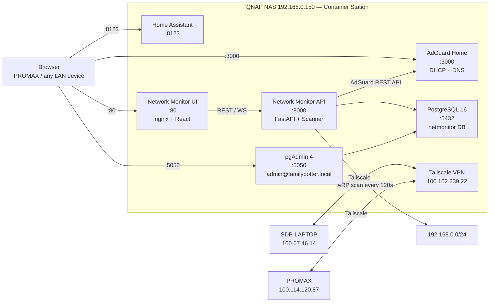

# Calgary House — Network Topology

_Generated: 06 May 2026_

---

## Physical Network Diagram

```mermaid
flowchart TD
    subgraph WAN [WAN / Internet]
        Starlink["Starlink Dish\n(Bypass Mode ~400 Mbps)"]
    end

    subgraph Core [Gym — Core Infrastructure]
        DecoMain["Deco X1500 Main Node\n192.168.0.90 · CC:BA:BD:87:2F:74\nWi-Fi 6 Mesh Gateway"]
        FS108P["Netgear FS108P\n8-port 100 Mbps PoE Switch\n⚠ bottleneck — Gigabit replacement pending"]
        QNAP["QNAP TS-264 NAS · 192.168.0.150\nAdGuard Home :3000\nHome Assistant :8123\nContainer Station · Tailscale\n100 Mbps (limited by FS108P)"]
        WD["WD EX4 NAS\n192.168.0.5\nEMPIRIDUMCLOUD"]
        Fingbox["Fingbox\n192.168.0.144"]
        NeoHub["Hive Neo Hub gen 2\n192.168.0.89"]
    end

    subgraph SW2 [Switch 2 — Netgear GS116 16-port Gigabit]
        NVR["HIK CCTV NVR\n192.168.0.15\n8-ch PoE NVR"]
        C460["Samsung C460 Printer\n192.168.0.87"]
        Velux["Velux Controller\n~192.168.0.59"]
    end

    subgraph SW3 [Switch 3 — Netgear ProSafe GS108 8-port Gigabit]
        SkyQ["Sky Q Main Box\n192.168.0.197\n(polls connectivity.sky.com frequently)"]
        CamGarage["HIK CCTV Garage\n192.168.0.33"]
        CamSide["HIK CCTV Side\n192.168.0.35"]
        CamFront["HIK CCTV Front\n192.168.0.36"]
        CamCh5["IPCamera 05\n192.168.0.34"]
        CamChickens["HIK CCTV Chickens\n192.168.0.32"]
    end

    subgraph PoE_SW1 [PoE Cameras on FS108P]
        CamGate["HIK CCTV Gate\n192.168.0.30"]
        CamRear["HIK CCTV Rear\n192.168.0.31"]
    end

    subgraph WiFiMesh [Wi-Fi Mesh — Wireless Backhaul]
        DecoAP1["Deco X1500 AP\n192.168.0.99\nFront Ensuite Bedroom"]
        DecoAP2["Deco X1500 AP\n192.168.0.100\nMaster Bedroom"]
    end

    Starlink -->|"WAN uplink"| DecoMain
    DecoMain -->|"Wired LAN"| FS108P
    FS108P -->|"100 Mbps"| QNAP
    FS108P -->|"Wired"| WD
    FS108P -->|"Wired"| Fingbox
    FS108P -->|"Wired"| NeoHub
    FS108P -->|"PoE"| CamGate
    FS108P -->|"PoE"| CamRear
    FS108P -->|"Gigabit uplink"| NVR
    FS108P -->|"Gigabit uplink"| C460
    FS108P -->|"Gigabit uplink"| Velux
    FS108P -->|"Gigabit uplink"| SkyQ
    FS108P -->|"Gigabit uplink"| CamGarage
    FS108P -->|"Gigabit uplink"| CamSide
    FS108P -->|"Gigabit uplink"| CamFront
    FS108P -->|"Gigabit uplink"| CamCh5
    FS108P -->|"Gigabit uplink"| CamChickens
    DecoMain -.->|"Wireless backhaul"| DecoAP1
    DecoMain -.->|"Wireless backhaul"| DecoAP2
```

> Note: Switch cascade order is FS108P → GS116 → GS108 per the network specification. Devices assigned per spec guidance (3 PoE cameras on FS108P; remaining cameras on GS108 with separate PSUs; NVR, printer, Velux on GS116). Switch internals simplified above for clarity.

---

## Logical / Service Diagram

---

## Device Count by Room

| Room | Total Devices | Wired | Wireless |
|---|---|---|---|
| Gym | 11 | 8 | 3 |
| Family Room | 8 | 2 | 6 |
| Master Bedroom | 7 | 1 | 6 |
| Lounge | 5 | 3 | 2 |
| Kitchen | 3 | 0 | 3 |
| Outside | 7 | 7 | 0 |
| Eddy | 2 | 1 | 1 |
| Front Ensuite Bedroom | 1 | 0 | 1 |
| The Love Den | 1 | 0 | 1 |
| Dining Room | 1 | 0 | 1 |
| Various / Unknown | 15 | 0 | 15 |
| **Total** | **61** | **22** | **39** |

---

## Device Count by Category

| Category | Count |
|---|---|
| Smart Home | 14 |
| Mobile | 10 |
| Security (CCTV) | 8 |
| Audio (Sonos + Yamaha) | 7 |
| Infrastructure | 5 |
| Computers | 4 |
| Entertainment | 6 |
| Network | 3 |
| Printers | 3 |
| Unknown | 4 |
| **Total** | **64*** |

_* Some devices appear in multiple scans/sources_

---

## IP Address Reservations (AdGuard DHCP Static Leases)

| IP | Hostname | MAC |
|---|---|---|
| 192.168.0.75 | PhilipsAir | D0:BA:E4:E7:95:25 |
| 192.168.0.77 | CliveVacuum | AC:15:A2:2D:9B:69 |
| 192.168.0.79 | FamilyiPad | 00:8A:76:9C:B1:8A |
| 192.168.0.52 | SDP-LAPTOP | E8:6F:38:A9:DF:57 |

---

## Network Speed Expectations

| Segment | Current | After Gigabit Switch Replacement |
|---|---|---|
| Starlink WAN | ~400 Mbps | ~400 Mbps |
| Deco X1500 Main → FS108P | 100 Mbps | 1 Gbps |
| QNAP NAS | 100 Mbps | 1 Gbps |
| Wired devices (downstream GS116 / GS108) | 1 Gbps | 1 Gbps (unchanged) |
| Wi-Fi (Deco mesh, Wi-Fi 6) | Up to ~400 Mbps | Up to ~400 Mbps |
