# FamilyPotter Home Network — Architecture & Operations Guide

> **Last updated:** 2026-05-08 (HIK CCTV MACs added; ip_type set to Static in network monitor DB)  
> **Status:** Live — cutover to Starlink/QNAP gateway complete

---

## Table of Contents

1. [Overview](#overview)
2. [Network Diagram](#network-diagram)
3. [Physical Hardware](#physical-hardware)
4. [QNAP NAS — The Gateway](#qnap-nas--the-gateway)
5. [AdGuard Home — DHCP, DNS & Filtering](#adguard-home--dhcp-dns--filtering)
6. [Tailscale — Remote Access VPN](#tailscale--remote-access-vpn)
7. [ddclient — Dynamic DNS](#ddclient--dynamic-dns)
8. [IP Address Allocation](#ip-address-allocation)
9. [Boot & Persistence — How the Network Survives a Reboot](#boot--persistence--how-the-network-survives-a-reboot)
10. [Monitoring & Health Checks](#monitoring--health-checks)
11. [Repository & File Structure](#repository--file-structure)
12. [Deployment to QNAP](#deployment-to-qnap)
13. [Remote Access Cheat Sheet](#remote-access-cheat-sheet)
14. [Planned Enhancements](#planned-enhancements)
15. [Troubleshooting](#troubleshooting)

---

## Overview

The FamilyPotter home network uses a **QNAP TS-264 NAS** as the primary network gateway, replacing the previous Sky ER110 broadband router. Internet access is provided by **Starlink Gen 3** (running in bypass mode). All DHCP, DNS, and network filtering functions are handled by **AdGuard Home** running as a Docker container on the NAS. Remote access from outside the home is via **Tailscale**, which tunnels through Starlink's CGNAT without requiring any port forwarding.

### Why this architecture?

| Concern | Solution |
|---|---|
| Full control over DHCP and DNS | AdGuard Home on NAS |
| Network-wide ad/tracker/malware blocking | AdGuard Home filter lists |
| Remote access through Starlink CGNAT | Tailscale VPN (no port-forwarding needed) |
| Dynamic DNS for future public IP | ddclient updating familypotter.ddns.net |
| Persistent config across NAS reboots | `/etc/config/autorun.sh` hook |
| Visibility into all LAN devices | AdGuard DHCP leases + Fing/Fingbox |
| No single point of failure beyond ISP | NAS restarts auto-recover all services |

---

## Network Diagram

```mermaid
flowchart TD
    subgraph WAN["WAN — Starlink CGNAT (100.64.x.x)"]
        Internet["🌐 Internet"]
        Starlink["Starlink Gen 3 Dish\n(Bypass Mode)\nAssigns CGNAT IP to NAS eth0"]
    end

    subgraph NAS["QNAP TS-264 NAS — 192.168.0.150"]
        eth0["eth0 — WAN Interface\nMAC: 24:5E:BE:6D:25:88\nIP: 100.64.x.x (DHCP from Starlink)"]
        eth1["eth1 — LAN Interface\nMAC: 24:5E:BE:6D:25:89\nIP: 192.168.0.150 (static)"]
        IPTables["iptables\nNAT Masquerade + Forwarding\n(setup-routing.sh)"]
        AdGuard["AdGuard Home\nDHCP server (eth1)\nDNS resolver (port 53)\nWeb UI (port 3000)"]
        Tailscale["Tailscale\nVPN peer: familypotter-nas\nAdvertises 192.168.0.0/24"]
        ddclient["ddclient\nDDNS updater\nfamilypotter.ddns.net"]
    end

    subgraph LAN["Home LAN — 192.168.0.0/24"]
        TLSwitch["TP-Link TL-SG108PE\n8-port Gigabit PoE+\n(primary switch)"]
        GSSwitch["NETGEAR GS116\n16-port Gigabit\n(room 2 expansion)"]

        subgraph WiFi["WiFi"]
            DecoX1500["TP-Link Deco X1500\nMain Node\n192.168.0.2"]
        end

        subgraph CCTV["CCTV"]
            HIKGate["HIK CCTV Gate (Side)\n192.168.0.35\n(PoE port 1 — TL-SG108PE)"]
            HIKFront["HIK CCTV Front\n192.168.0.36\n(PoE port 2 — TL-SG108PE)"]
            HIKRear["HIK CCTV Rear\n192.168.0.31\n(PoE port 3 — TL-SG108PE)"]
            HIKNVR["HIK NVR\nDS-7608NI-E2/8P/A\n192.168.0.15"]
            HIKGarage["HIK CCTV Garage\n192.168.0.33\n(dedicated PoE PSU)"]
            DownstreamSwitch["Downstream Switch\n(unmanaged, no PoE)"]
            HIKGateRoad["HIK CCTV Gate (Road)\n192.168.0.30\n(dedicated PoE PSU)"]
            HIKChickens["HIK CCTV Chickens\n192.168.0.32\n(offline)"]
        end

        subgraph Wired["Wired Devices"]
            PROMAX["PROMAX Desktop\n192.168.0.68"]
            SDPLAPTOP["SDP-LAPTOP\n192.168.0.53 (dynamic)"]
            MAINDESK["MAINDESK\n192.168.0.72"]
            Fingbox["Fingbox\n192.168.0.144"]
        end

        subgraph Media["Media Devices"]
            SkyQMain["Sky Q Main\n192.168.0.51"]
            SkyQSat1["Sky Q Sat 1\n192.168.0.73"]
            SkyQSat2["Sky Q Sat 2\n192.168.0.197"]
        end

        subgraph Sonos["7× Sonos Speakers (all static)"]
            SonosL["Lounge — .93"]
            SonosD["Dining — .95"]
            SonosF["Family — .97"]
            SonosB["Bedroom — .98"]
            SonosK["Kitchen — .80"]
            SonosE["Eddy — .67"]
            SonosG["Gym — .94"]
        end

        subgraph Smart["Smart Home & IoT"]
            Miele1["Miele Appliance\n.59"]
            Miele2["Miele Appliance\n.62"]
            Velux["Velux Gateway\n.61"]
            Switchbot["SwitchBot Hub\n.54"]
        end
    end

    subgraph Remote["Remote Access (off-site)"]
        Phone["Mobile Phone / Tablet\nTailscale client"]
        Laptop["Laptop (away from home)\nTailscale client"]
    end

    Internet --> Starlink
    Starlink -->|"DHCP — CGNAT IP"| eth0
    eth0 <-->|"IP forwarding\nNAT masquerade"| IPTables
    IPTables <--> eth1
    eth0 --> Tailscale
    eth0 --> ddclient
    AdGuard -->|"DHCP leases\nDNS responses\nbound on eth1"| eth1
    eth1 -->|"1 Gbps → port 8"| TLSwitch
    TLSwitch -->|"port 1 PoE"| HIKGate
    TLSwitch -->|"port 2 PoE"| HIKFront
    TLSwitch -->|"port 3 PoE"| HIKRear
    TLSwitch -->|"port 5"| Fingbox
    TLSwitch -->|"port 6"| GSSwitch
    TLSwitch -->|"port 7"| DecoX1500
    TLSwitch --> PROMAX
    TLSwitch --> SDPLAPTOP
    TLSwitch --> MAINDESK
    TLSwitch --> SkyQMain
    TLSwitch --> SkyQSat1
    GSSwitch --> SkyQSat2
    GSSwitch --> HIKNVR
    GSSwitch --> HIKGarage
    GSSwitch --> DownstreamSwitch
    DownstreamSwitch --> HIKGateRoad
    DownstreamSwitch --> HIKChickens
    TLSwitch --> SonosL
    TLSwitch --> SonosD
    TLSwitch --> SonosF
    TLSwitch --> SonosB
    TLSwitch --> SonosK
    TLSwitch --> SonosE
    TLSwitch --> SonosG
    TLSwitch --> Miele1
    TLSwitch --> Miele2
    TLSwitch --> Velux
    TLSwitch --> Switchbot

    Phone <-->|"Tailscale tunnel\nthrough CGNAT"| Tailscale
    Laptop <-->|"Tailscale tunnel\nthrough CGNAT"| Tailscale
```



### Traffic Flow — A Device Browsing the Web

```
Device (e.g. PROMAX)
  │
  ├─ DNS query → 192.168.0.150:53 (AdGuard Home)
  │    AdGuard checks filter lists → if allowed, forwards to Cloudflare DoH (1.1.1.1)
  │    Returns IP to device
  │
  ├─ TCP connection → 192.168.0.150 (default gateway)
  │    iptables FORWARD: eth1→eth0 ACCEPT
  │    iptables NAT: POSTROUTING MASQUERADE (source IP becomes Starlink CGNAT IP)
  │
  └─ Packet exits via eth0 → Starlink → Internet
       Response returns via eth0 → RELATED,ESTABLISHED ACCEPT → eth1 → device
```

---

## Physical Hardware

### Internet Connection

| Item | Detail |
|---|---|
| **ISP** | Starlink Gen 3 (UK residential) |
| **Connection type** | CGNAT — WAN IP is `100.64.x.x` (not internet-routable) |
| **Dish mode** | Bypass mode — dish hands IP directly to NAS eth0, no Starlink router in path |
| **Speed** | ~400 Mbps down / ~50 Mbps up typical |
| **IPv6** | /56 prefix delegation available (enabled via setup-routing.sh) |

### Gateway — QNAP TS-264 NAS

| Item | Detail |
|---|---|
| **Model** | QNAP TS-264 |
| **NIC** | Intel 2.5GbE dual-port |
| **eth0** | WAN — connected to Starlink Gen 3 LAN port — MAC `24:5E:BE:6D:25:88` |
| **eth1** | LAN — connected to TP-Link TL-SG108PE port 8 — MAC `24:5E:BE:6D:25:89` — IP `192.168.0.150` |
| **OS** | QNAP QTS |
| **Container runtime** | Container Station (Docker Compose) |
| **Stack path on NAS** | `/share/CACHEDEV1_DATA/Container/familypotter-network/` |

### Switching

| Switch | Ports | MAC Address | Location | Connected to |
|---|---|---|---|---|
| TP-Link TL-SG108PE | 8-port Gigabit PoE+ | `50-3D-D1-52-4A-99` | Primary room | NAS eth1 (port 8) → all primary devices — management UI: `http://192.168.0.105` |
| NETGEAR GS116 | 16-port Gigabit | – | Room 2 | Uplinked to TL-SG108PE port 6 – hosts NVR (192.168.0.15) and garage camera (192.168.0.33, dedicated PoE PSU); a further downstream unmanaged switch carries gate-road camera (192.168.0.30) and chickens camera (192.168.0.32), both with dedicated PoE PSUs. GS116 has no PoE. |

> **Note:** The TL-SG108PE replaced the previous NETGEAR ProSafe FS108P.

#### TL-SG108PE Port Map

Live link status queried 2026-05-08 — all ports show **0 bad packets**.

| Port | PoE | Hostname | Device | Link Status | Notes |
|---|---|---|---|---|---|
| 1 | ✅ | HIK CCTV Gate | HikVision PoE camera — Gate | **100Full** | Expected — HikVision cameras are 100BASE-TX only |
| 2 | ✅ | HIK CCTV Front | HikVision PoE camera — Front | **100Full** | Expected — HikVision cameras are 100BASE-TX only |
| 3 | ✅ | HIK CCTV Rear | HikVision PoE camera — Rear | **100Full** | Expected — HikVision cameras are 100BASE-TX only |
| 4 | — | *(empty)* | — | Link Down | — |
| 5 | — | Fingbox | Fing network monitor | **100Full** | Fingbox NIC or cable limited to 100 Mbps |
| 6 | – | GS116 | NETGEAR GS116 uplink (room 2 expansion) | **1000Full** | – |
| 7 | – | Deco X1500 Main Node | TP-Link Deco X1500 (main mesh node) | **1000Full** | – |
| 8 | — | CALGARYHOUSE | QNAP NAS eth1 (`192.168.0.150`) | **1000Full** | — |

### WiFi

| Item | Detail |
|---|---|
| **Model** | TP-Link Deco X1500 |
| **Role** | Main mesh node (Access Point mode) |
| **IP** | `192.168.0.2` |
| **Connection** | LAN port → TL-SG108PE port 7 |

### CCTV Devices

All HikVision cameras and NVR use **fixed IPs configured directly on the device** (not DHCP reservations — AdGuard has no DHCP leases for these devices). MACs sourced from network monitor DB (live ARP discovery).

| Device | Hostname | IP | Model | Serial Number | Firmware | Connection | PoE Source |
|---|---|---|---|---|---|---|---|
| NVR | hikcctv-nvr | 192.168.0.15 | DS-7608NI-E2/8P/A | DS-7608NI-E2/8P/A0820151105AARR552418366WCVU | 170228 | GS116 | — (NVR, not camera) |
| Camera — Gate (Side) | hikcctv-gate-side | 192.168.0.35 | DS-2CD2342WD-I | DS-2CD2342WD-I20150814BBWR534984342 | V5.4.5 build 170124 | TL-SG108PE port 1 | Switch PoE |
| Camera — Front | hikcctv-front | 192.168.0.36 | DS-2CD2386G2-I | DS-2CD2386G2-I20191212AAWRD98231918 | V5.5.97 build 190712 | TL-SG108PE port 2 | Switch PoE |
| Camera — Rear | hikcctv-rear | 192.168.0.31 | DS-2CD2322WD-I | DS-2CD2322WD-I20160129BBWR572690415 | V5.4.5 build 170124 | TL-SG108PE port 3 | Switch PoE |
| Camera — Garage | hikcctv-garage | 192.168.0.33 | DS-2CD2355FWD-I/G | DS-2CD2355FWD-I/G20170713AAWR798539497 | V5.5.97 build 190712 | GS116 | Dedicated PoE PSU |
| Camera — Gate (Road) | hikcctv-gate | 192.168.0.30 | DS-2CD2642FWD-IS | DS-2CD2642FWD-IS20160415BBWR591755936 | V5.4.5 build 170124 | Switch off GS116 | Dedicated PoE PSU |
| Camera — Chickens | hikcctv-chickens | 192.168.0.32 | Unknown | — | — | Switch off GS116 | — (currently offline) |

> **Note:** GS116 itself has no PoE. Garage and gate-road cameras use dedicated PoE PSUs. A further unmanaged downstream switch off the GS116 carries the gate-road and chickens cameras.

---

## QNAP NAS — The Gateway

The NAS acts as the **default gateway** for the entire home network. It has two network interfaces with completely different roles:

### eth0 — WAN (Upstream / Internet)

- Receives a CGNAT IP (`100.64.x.x`) from Starlink via DHCP
- All outbound internet traffic leaves via this interface
- The iptables NAT masquerade rule makes all LAN devices share this single IP
- Docker containers do NOT use this IP directly — they use `network_mode: host` and share the NAS's routing table

### eth1 — LAN (Home Network Gateway)

- Permanently set to `192.168.0.150/24` (static, no gateway set — the NAS IS the gateway)
- AdGuard Home binds its DHCP server and DNS resolver to this interface
- All LAN devices set this as their default gateway and DNS server
- DNS for eth1 is `127.0.0.1` — the NAS resolves its own names via AdGuard

### IP Routing — How Traffic Moves

The `setup-routing.sh` script (run at boot via `autorun.sh`) configures the Linux kernel to act as a router:

```
1. sysctl net.ipv4.ip_forward=1          — kernel will forward packets between interfaces
2. iptables NAT MASQUERADE               — rewrite source IP of LAN→WAN packets to eth0 IP
3. iptables FORWARD eth1→eth0 ACCEPT     — allow new connections from LAN to WAN
4. iptables FORWARD eth0→eth1 ESTABLISHED ACCEPT — allow replies back from WAN to LAN
5. iptables INPUT WAN NEW DROP           — block unsolicited inbound from Starlink
6. iptables INPUT DHCP/DNS ACCEPT        — ensure QNAP's own firewall (QuFirewall) doesn't block DHCP/DNS
7. IPv6 forwarding + RA accept-ra=2      — IPv6 pass-through for Starlink prefix
8. NIC ring buffers 4096 rx/tx           — reduce packet drops under load
```

### QNAP ISC dhcpd Conflict

QNAP QTS runs its own ISC DHCP daemon (`dhcpd`) which conflicts with AdGuard Home on UDP port 67. The `kill-qnap-dhcpd.sh` script kills the QNAP dhcpd processes at boot (after a 15-second delay to let them start first). The `network-health-check.sh` re-kills them if they ever reappear.

---

## AdGuard Home — DHCP, DNS & Filtering

AdGuard Home is the central network services layer. It runs as a Docker container on the NAS with `network_mode: host` — meaning it shares the NAS's network stack directly and can bind to real LAN IPs.

### DHCP Server

AdGuard handles DHCP for the entire `192.168.0.0/24` subnet:

| Setting | Value |
|---|---|
| Interface | eth1 |
| Gateway sent to clients | `192.168.0.150` |
| DNS sent to clients | `192.168.0.150` |
| Dynamic pool | `192.168.0.52` – `192.168.0.248` |
| Lease duration | 24 hours |
| Local domain | `.lan` |

Static leases (reserved IPs by MAC address) are configured for all known devices — see [IP Address Allocation](#ip-address-allocation).

### DNS Resolver

AdGuard resolves DNS for all LAN devices. It:

1. **Checks filter lists** — if a domain is on a blocklist (ads, trackers, malware), it returns `NXDOMAIN` immediately
2. **Checks local DNS rewrites** — if a `.lan` hostname is defined (e.g. `nas.lan`), it returns the configured IP
3. **Forwards upstream** — all other queries go to Cloudflare DoH (`1.1.1.1/dns-query`, `1.0.0.1/dns-query`) or Google DoH (`8.8.8.8/dns-query`) in load-balanced mode
4. **DNSSEC validation** — enabled, ensuring DNS responses haven't been tampered with

### DNS-over-HTTPS (DoH) Upstream

All upstream DNS uses HTTPS (encrypted), so your ISP (Starlink) cannot see which domains your household visits.

```
Primary:   https://1.1.1.1/dns-query   (Cloudflare)
           https://1.0.0.1/dns-query   (Cloudflare secondary)
Fallback:  https://8.8.8.8/dns-query   (Google)
Bootstrap: 1.1.1.1, 8.8.8.8           (plain DNS to resolve DoH servers at startup)
```

### Active Filter Lists

| List | Purpose |
|---|---|
| AdGuard DNS filter | Ads, trackers, telemetry |
| AdGuard SDNS filter | Extended DNS-level blocking |
| AdAway Default Blocklist | Mobile ad networks |
| URLhaus Malicious URL Blocklist | Known malware domains |

### Local DNS Rewrites (`.lan` hostnames)

| Hostname | IP | Purpose |
|---|---|---|
| `nas.lan` | 192.168.0.150 | QNAP NAS / AdGuard |
| `qnap.lan` | 192.168.0.150 | Alias for above |
| `promax.lan` | 192.168.0.68 | PROMAX desktop |
| `maindesk.lan` | 192.168.0.72 | MAINDESK PC |
| `fingbox.lan` | 192.168.0.144 | Fing network monitor |
| `sonosfamily.lan` | 192.168.0.97 | Sonos speaker — Family room |
| `sonoslounge.lan` | 192.168.0.93 | Sonos speaker — Lounge |
| `sonosdining.lan` | 192.168.0.95 | Sonos speaker — Dining |
| `sonosbed.lan` | 192.168.0.98 | Sonos speaker — Bedroom |
| `sonoskitchen.lan` | 192.168.0.80 | Sonos speaker — Kitchen |
| `sonoseddy.lan` | 192.168.0.67 | Sonos speaker — Eddy's room |
| `sonosgym.lan` | 192.168.0.94 | Sonos speaker — Gym |

### Web UI

AdGuard Home web interface: **http://192.168.0.150:3000**

(Port 80 is reserved by QNAP QTS — AdGuard uses port 3000.)

Admin credentials are **not** documented in this repository. The web password is stored as a **bcrypt hash** in [`AdGuard/conf/AdGuardHome.yaml`](AdGuard/conf/AdGuardHome.yaml). Use the AdGuard Home UI **Settings → General settings** to change the password if this config was ever exposed in plaintext elsewhere.

---

## Tailscale — Remote Access VPN

Tailscale provides secure access to the home network from anywhere in the world, without requiring port forwarding — which is impossible under Starlink's CGNAT.

### How It Works

Tailscale creates an encrypted peer-to-peer mesh network (WireGuard under the hood). The NAS is registered as a Tailscale node named `familypotter-nas` and advertises the entire home subnet (`192.168.0.0/24`) as a subnet route. When you connect your phone or laptop to Tailscale from outside, you can reach every home device at its normal `192.168.0.x` address.

```
[Phone abroad] ←— encrypted WireGuard tunnel —→ [Tailscale coordination server]
                                                        ↕ (relay if direct fails)
                                                  [NAS familypotter-nas]
                                                        ↕
                                              [192.168.0.0/24 home LAN]
```

### Subnet Route Approval (One-Time Setup)

In the Tailscale admin console (https://login.tailscale.com/admin), the NAS's advertised subnet `192.168.0.0/24` must be approved. This was done during initial setup.

### Important: Devices Already on the Home LAN

Devices physically on the home LAN (PROMAX, SDP-LAPTOP) must have **"Accept Routes" turned OFF** in Tailscale preferences. If it is on, Tailscale creates a routing table entry for `192.168.0.0/24` with a lower metric than the physical Ethernet route, causing network failures (the device tries to route to other home devices via the VPN tunnel instead of directly).

### Tailscale Nodes

| Node | Identity |
|---|---|
| `familypotter-nas` | The NAS — acts as subnet router for the whole home LAN |
| PROMAX | Registered (Accept Routes = OFF) |

---

## ddclient — Dynamic DNS

ddclient runs as a Docker container and updates the DNS record `familypotter.ddns.net` with the current WAN IP address every 5 minutes.

**Important caveat:** UK Starlink residential uses CGNAT (`100.64.x.x`). This is NOT a public internet IP, so the DDNS record will reflect the CGNAT address, which is not reachable from the internet. The record is maintained ready for when a public IP is available (Starlink Priority plan).

**For remote access now:** Use Tailscale (above) — it works through CGNAT.

**DDNS account:** `familypotter.ddns.net` via DynDNS, account `CalgaryHouse`. Credentials stored in `DDNS/ddclient.conf` (not committed to git).

---

## IP Address Allocation

### Network Ranges

| Range | Purpose |
|---|---|
| `192.168.0.1` | Reserved (formerly Sky ER110 gateway) |
| `192.168.0.2` | AX1500 WiFi AP management (planned) |
| `192.168.0.15` | HikVision NVR (`hikcctv-nvr`) |
| `192.168.0.20`–`.36` | HikVision CCTV cameras – active: `.30`–`.36`; `.20`–`.29` reserved/unallocated. **All CCTV devices use fixed IPs configured directly on the device** (not DHCP reservations) |
| `192.168.0.51`–`.51` | Sky Q Main |
| `192.168.0.52`–`.248` | Dynamic DHCP pool |
| `192.168.0.150` | QNAP NAS (eth1) — gateway + DNS |

### Static Leases (Reserved by MAC Address)

| Hostname | IP | MAC Address | Notes |
|---|---|---|---|
| skyq-main | 192.168.0.51 | 78:3e:53:a3:9d:ca | Sky Q main box |
| skyq-sat1 | 192.168.0.73 | 78:3e:53:a1:dc:f2 | Sky Q satellite 1 |
| skyq-sat2 | 192.168.0.197 | 78:3e:53:80:8a:fa | Sky Q satellite 2 |
| sonoseddy | 192.168.0.67 | 94:9f:3e:1f:fa:ec | Sonos — Eddy's room |
| promax | 192.168.0.68 | e8:cf:83:8e:0b:69 | PROMAX desktop PC |
| family-ipad | 192.168.0.70 | c6:6f:be:a5:27:fd | Family iPad |
| maindesk | 192.168.0.72 | 30:d0:42:ff:9e:0f | MAINDESK PC |
| sonoslounge | 192.168.0.93 | b8:e9:37:ab:36:80 | Sonos — Lounge |
| sonosgym | 192.168.0.94 | b8:e9:37:ab:29:ec | Sonos — Gym |
| sonosdining | 192.168.0.95 | b8:e9:37:ab:32:00 | Sonos — Dining room |
| sonosfamily | 192.168.0.97 | b8:e9:37:9d:19:aa | Sonos — Family room |
| sonosbed | 192.168.0.98 | b8:e9:37:ab:29:b6 | Sonos — Bedroom |
| sonoskitchen | 192.168.0.80 | 94:9f:3e:72:fd:cc | Sonos — Kitchen |
| fingbox | 192.168.0.144 | f0:23:b9:eb:12:f9 | Fing network monitor |
| qnap-nas-eth1 | 192.168.0.151 | 24:5e:be:6d:25:89 | NAS eth1 (self-record) |
| czkawka-dedup | 192.168.0.78 | 02:eb:43:1c:19:40 | Czkawka deduplication tool |
| hikcctv-nvr | 192.168.0.15 | 28:57:be:86:bf:00 | Fixed IP (device-configured) — HikVision NVR – DS-7608NI-E2/8P/A – on GS116 |
| hikcctv-gate | 192.168.0.30 | bc:ad:28:22:20:7c | Fixed IP (device-configured) — HikVision camera – Gate (Road) – DS-2CD2642FWD-IS – downstream switch off GS116 (dedicated PoE PSU) |
| hikcctv-rear | 192.168.0.31 | 28:57:be:b5:99:de | Fixed IP (device-configured) — HikVision camera – Rear – DS-2CD2322WD-I – TL-SG108PE port 3 |
| hikcctv-chickens | 192.168.0.32 | – (TBC — offline) | Fixed IP (device-configured) — HikVision camera – Chickens – currently offline – downstream switch off GS116 |
| hikcctv-garage | 192.168.0.33 | 4c:bd:8f:3d:f2:1d | Fixed IP (device-configured) — HikVision camera – Garage – DS-2CD2355FWD-I/G – GS116 (dedicated PoE PSU) |
| hikcctv-gate-side | 192.168.0.35 | c4:2f:90:7b:14:6f | Fixed IP (device-configured) — HikVision camera – Gate (Side) – DS-2CD2342WD-I – TL-SG108PE port 1 |
| hikcctv-front | 192.168.0.36 | 98:df:82:48:75:e4 | Fixed IP (device-configured) — HikVision camera – Front – DS-2CD2386G2-I – TL-SG108PE port 2 |
| Samsung C460 Printer | 192.168.0.87 | 30:cd:a7:3d:44:4f | Samsung C460 Colour Printer |

---

## Boot & Persistence — How the Network Survives a Reboot

QNAP QTS resets iptables rules on every reboot. The persistence mechanism works as follows:

```
QNAP boots
    │
    └─ /etc/config/autorun.sh runs (preserved across QTS firmware updates)
           │
           ├─ sysctl net.ipv4.ip_forward=1       ← kernel IP forwarding
           ├─ sysctl net.ipv6.conf.all.forwarding=1
           ├─ sysctl net.ipv6.conf.eth0.accept_ra=2   ← IPv6 RA even with forwarding
           ├─ ethtool -G eth0/eth1 rx 4096 tx 4096    ← NIC buffer sizing
           ├─ iptables NAT MASQUERADE                  ← outbound NAT
           ├─ iptables FORWARD rules                   ← inter-interface routing
           ├─ iptables INPUT DHCP+DNS ACCEPT            ← allow port 67, 53 through
           └─ kill-qnap-dhcpd.sh (15s delay)           ← remove conflicting DHCP daemon
    │
    └─ Container Station auto-starts docker-compose stack
           │
           ├─ adguardhome container starts → binds eth1:53 (DNS) + eth1:67 (DHCP) + :3000 (UI)
           ├─ tailscale container starts → reconnects to Tailscale network
           └─ ddclient container starts → begins monitoring WAN IP
```

The `network-health-check.sh` script runs every 30 minutes via QNAP cron and auto-repairs any iptables rules that may have been flushed by QTS's own firewall manager.

---

## Monitoring & Health Checks

### AdGuard Home Dashboard

- **URL:** http://192.168.0.150:3000
- **What to look at:**
  - Query log — shows every DNS lookup from every device
  - Statistics — shows blocked percentage (typically 15–30%)
  - DHCP leases — current clients and their IPs
  - Filters — update status for blocklists

### Network Health Check Script

`scripts/network-health-check.sh` — run from QNAP SSH or cron. Checks:

1. `adguardhome` container is in `Up` state
2. No other process has taken UDP port 67 from AdGuard
3. AdGuard is bound to `192.168.0.150:53`
4. iptables DHCP/DNS INPUT rules are present (auto-inserts them if missing)
5. iptables NAT MASQUERADE rule present (auto-inserts if missing)
6. Ping to `1.1.1.1` succeeds (WAN connectivity)

Exit code 0 = all healthy. Exit code 1 = at least one failure (check stdout for details).

**Run manually:**
```sh
ssh admin@192.168.0.150
sh /share/CACHEDEV1_DATA/Container/familypotter-network/scripts/network-health-check.sh
```

### Fingbox

A Fingbox device (`192.168.0.144`) is connected to the LAN and provides:
- Continuous device discovery and monitoring
- Alerts for new unknown devices joining the network
- Internet speed measurements
- Integration with the Fing app (iOS/Android)

---

## Repository & File Structure

```
D:\Network Privacy\                     ← Git repository root
│
├── docker-compose.yml                  ← Main container stack definition
├── .env                                ← Secrets (NOT committed to git)
├── .gitignore
├── README.md
├── NETWORK-ARCHITECTURE.md             ← This document
│
├── AdGuard/
│   ├── conf/
│   │   └── AdGuardHome.yaml            ← Full AdGuard config (DHCP, DNS, filters, leases)
│   └── work/                           ← Runtime data (NOT committed — created by container)
│       └── data/
│           └── leases.json             ← Live DHCP lease database
│
├── DDNS/
│   └── ddclient.conf                   ← DDNS credentials (NOT committed to git)
│
├── VPN/
│   ├── tailscale/                      ← Tailscale state (NOT committed — contains private keys)
│   └── wireguard/
│       └── README-wireguard.md         ← WireGuard config template (pending public IP)
│
├── scripts/
│   ├── autorun.sh                      ← Deployed to /etc/config/autorun.sh on QNAP
│   ├── setup-routing.sh                ← iptables + sysctl gateway config (run at boot)
│   ├── kill-qnap-dhcpd.sh              ← Kills QNAP's conflicting ISC dhcpd
│   ├── network-health-check.sh         ← Monitoring script (run every 30 min from cron)
│   └── deploy-to-qnap.ps1              ← Windows PowerShell deployment script
│
└── DHCP/                               ← Legacy subfolder (superseded by root structure)
    ├── docker-compose.yml
    ├── adguard/conf/AdGuardHome.yaml
    ├── ddclient/ddclient.conf
    └── scripts/setup-routing.sh
```

### What Is and Isn't Committed

| Path | Committed | Reason |
|---|---|---|
| `docker-compose.yml` | ✅ Yes | No secrets (`.env` is separate) |
| `.env` | ❌ No | Contains Tailscale auth key |
| `AdGuard/conf/AdGuardHome.yaml` | ✅ Yes | Config only (admin password is a bcrypt hash — treat as sensitive; rotate via UI if repo was exposed) |
| `AdGuard/work/` | ❌ No | Runtime data, large, changes constantly |
| `DDNS/ddclient.conf` | ❌ No | Contains DDNS password |
| `VPN/tailscale/` | ❌ No | Contains private keys |
| `scripts/*.sh` | ✅ Yes | No secrets |
| `scripts/deploy-to-qnap.ps1` | ✅ Yes | No secrets |

---

## Deployment to QNAP

### First-Time Deployment (PowerShell on Windows)

```powershell
cd "D:\Network Privacy"
.\scripts\deploy-to-qnap.ps1
```

The script:
1. Maps the QNAP `Container` SMB share to drive `Q:`
2. Copies all non-secret files to `Q:\familypotter-network\`
3. Skips `.git`, `.vs`, `AdGuard\work`, `VPN\tailscale`, `DHCP` (legacy)
4. Unmaps the drive
5. Prints SSH commands to complete setup on the NAS

### Post-Copy Steps (SSH on QNAP)

```sh
ssh admin@192.168.0.150
cd /share/CACHEDEV1_DATA/Container/familypotter-network

# Install routing script
chmod +x scripts/setup-routing.sh
grep -q "setup-routing" /etc/config/autorun.sh \
  || echo 'sh /share/CACHEDEV1_DATA/Container/familypotter-network/scripts/setup-routing.sh >> /var/log/routing-setup.log 2>&1' >> /etc/config/autorun.sh
sh scripts/setup-routing.sh

# Start containers
docker compose up -d
docker compose logs -f    # watch startup, Ctrl+C when settled
```

### Updating the Running Stack

```sh
ssh admin@192.168.0.150
cd /share/CACHEDEV1_DATA/Container/familypotter-network
docker compose pull           # pull latest images
docker compose up -d          # recreate changed containers
```

---

## Remote Access Cheat Sheet

### From Inside the Home Network

| Service | URL / Command |
|---|---|
| AdGuard Home UI | http://192.168.0.150:3000 |
| QNAP QTS UI | http://192.168.0.150:8080 |
| NAS SSH | `ssh admin@192.168.0.150` |
| Home Assistant | http://192.168.0.150:8123 |

### From Outside (Tailscale Connected)

Same URLs as above — Tailscale subnet routing makes `192.168.0.x` addresses reachable from anywhere.

Tailscale admin: https://login.tailscale.com/admin (login with GitHub `familypotter.github`)

---

## Planned Enhancements

| Phase | Enhancement | Status |
|---|---|---|
| 3 | TP-Link Deco X1500 WiFi (main node) | ✅ Active — port 6 of TL-SG108PE |
| 4 | HikVision PoE cameras (full system) | ✅ Active — 7 devices total (6 cameras + NVR); all firmware versions on record. Cameras on TL-SG108PE ports 1–3, GS116, and downstream switch off GS116 |
| 5 | Sonos DHCP verification | ⏳ Verify after next reboot |
| 6 | Home Assistant container | ✅ Active — running at http://192.168.0.150:8123 |
| 7 | WireGuard VPN | ⏳ Waiting for public IP |

See `DHCP/.cursor/plans/familypotter_network_cutover_8e344924.plan.md` for full details on each phase.

---

## Troubleshooting

### Devices Not Getting DHCP Leases

1. SSH to NAS and check AdGuard is running: `docker ps | grep adguard`
2. Check UDP/67 ownership: `netstat -ulnp | grep ':67'` — should show `AdGuardHome`
3. If QNAP dhcpd is squatting on port 67: `sh scripts/kill-qnap-dhcpd.sh`
4. Check iptables: `iptables -L INPUT | grep 67` — should show ACCEPT rule
5. On the client device: `ipconfig /release && ipconfig /renew` (Windows) or reconnect

### No Internet on a Device

1. Check device has gateway `192.168.0.150`: `ipconfig` / `ip route`
2. Check NAS has WAN IP: `ssh admin@192.168.0.150` then `ip addr show eth0` — should show `100.64.x.x`
3. Check NAT rule: `iptables -t nat -L POSTROUTING` — should show MASQUERADE rule
4. Re-run routing setup: `sh /share/CACHEDEV1_DATA/Container/familypotter-network/scripts/setup-routing.sh`
5. Test from NAS: `ping 8.8.8.8` — if this fails, the issue is Starlink uplink

### DNS Not Resolving

1. Test DNS directly: `nslookup google.com 192.168.0.150`
2. Check AdGuard is listening: `netstat -ulnp | grep '192.168.0.150:53'`
3. Check AdGuard logs: `docker logs adguardhome --tail 50`
4. Check iptables INPUT rule allows port 53: `iptables -L INPUT | grep 53`

### Can't Reach AdGuard UI (port 3000)

1. Check container running: `docker ps | grep adguard`
2. If container stopped: `docker start adguardhome`
3. Check something else isn't on port 3000: `netstat -tlnp | grep 3000`

### Tailscale Not Connecting

1. Check container: `docker ps | grep tailscale`
2. Check Tailscale status: `docker exec tailscale tailscale status`
3. If re-auth needed: `docker exec tailscale tailscale login`
4. Admin console: https://login.tailscale.com/admin

### PROMAX or SDP-LAPTOP Route Conflict

Symptom: Can ping NAS but not other devices, or internet stops working after Tailscale connects.

Fix: In Tailscale tray icon → Preferences → uncheck **"Accept Routes"**. This prevents Tailscale from installing a low-metric route for `192.168.0.0/24` on a device that's already physically on that network.
